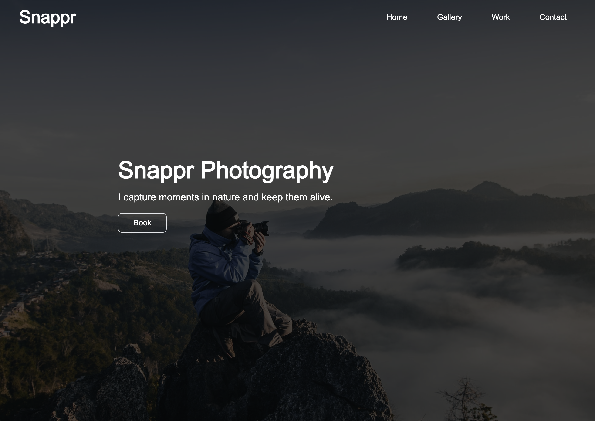
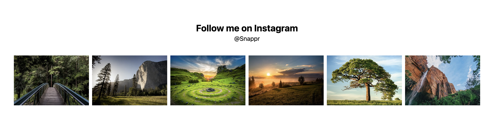
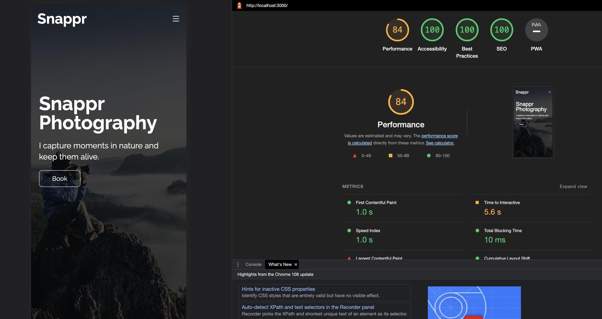

# Snappr  

**Snappr Photography Website**  

## Description  

This is a Photographer's Portfolio Website to showcase his/her works as well as communicaiton 
information for potential customers to contact him/her.  

In order to create this website following technologies were used:  
1. [Next JS](https://nextjs.org/)  
  
2. [Tailwind CSS](https://tailwindcss.com/)  
  

## Visuals  

Here are a few Images of the website.  





Here is a Lighthouse analysis of the website. There's always some room for improvements!  



## Installation  

Clone this repository by
```bash
git clone https://github.com/ShayanMHTB/snappr.git
```

move to the created folder
```bash
cd snappr
```

install project's dependencies
```bash
npm run install
```

## Usage  

After dependencies are installed and if termainal is not throwing any errors, simply run
```bash
# Development mode
npm run dev

# Build project
npm run build

# Start application
npm run start
```

In order to lint your code
```bash
npm run lint
```

## Support

For support simply contact me or open an issue in this repository, otherwise
for specific issues in `Next JS` or `Tailwind CSS` visit their according websites.  

## Contribution  

[](https://www.buymeacoffee.com/ShayanMHTB)  

## Authors & Acknowledgment  

The author of this repository: 
- [ShayanMHTB Website](https://shayanmhtb.com)

The images are all licence free from Unsplash.
In case you're using this website's layout, remember to use your own images.

## License  

[MIT LICENSE](https://github.com/ShayanMHTB/snappr/blob/main/LICENSE)  
  
